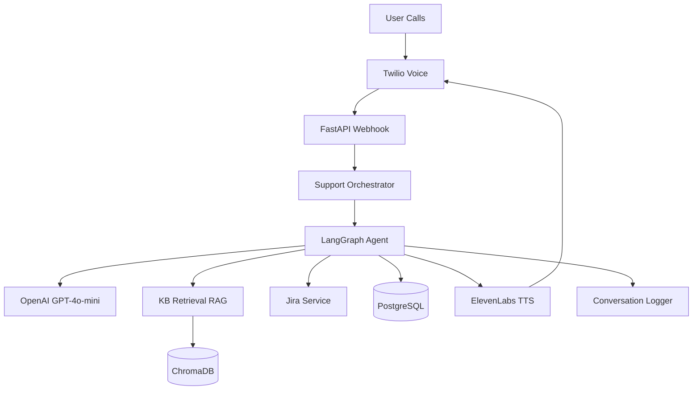

# IT Support Voice Assistant - Documentation

## Problem

IT support teams are overwhelmed with repetitive calls for common issues (printer problems, email setup, WiFi connectivity). Manual support is:

- **Expensive**: Requires 24/7 staff
- **Slow**: Long wait times
- **Inefficient**: Same issues resolved repeatedly

## Solution

Automated voice assistant that:

- Answers calls 24/7
- Provides step-by-step troubleshooting
- Retrieves solutions from knowledge base
- Escalates complex issues to humans
- Creates tickets automatically in Jira

## Architecture

## Documentation

- [User Guide](./user-guide.md) - How to use the system
- [Architecture](./architecture.md) - System design and components
