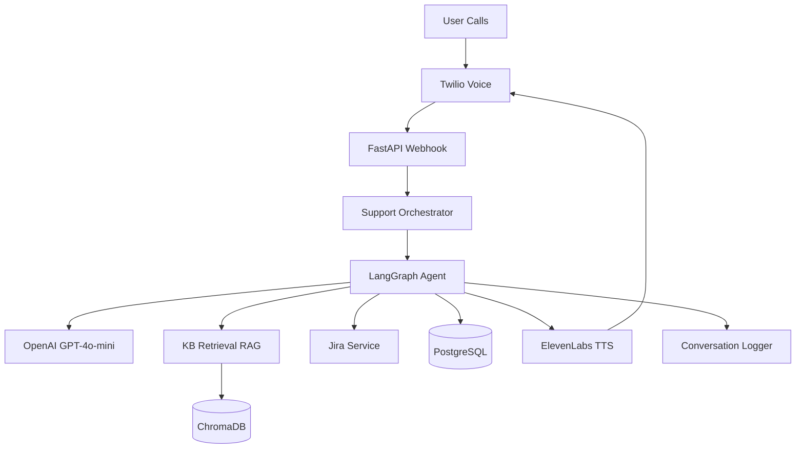
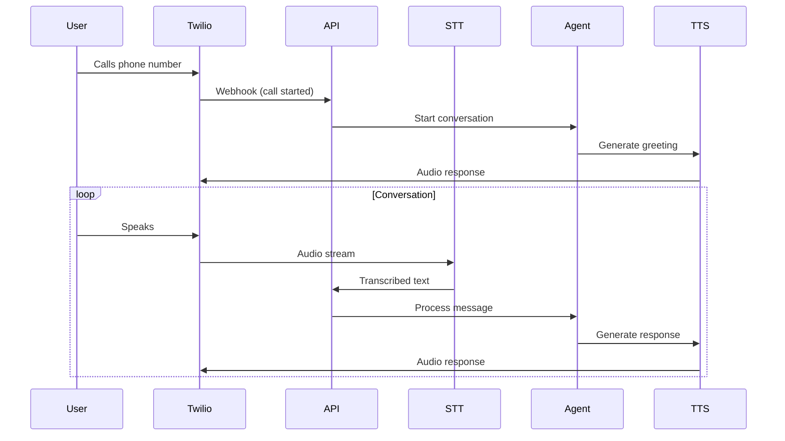
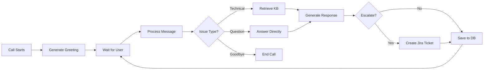
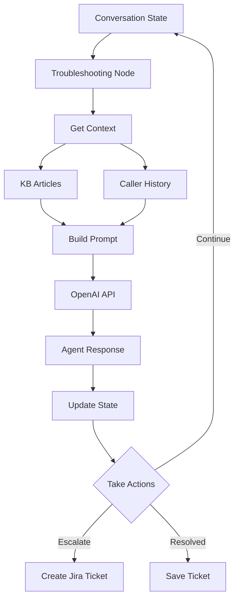
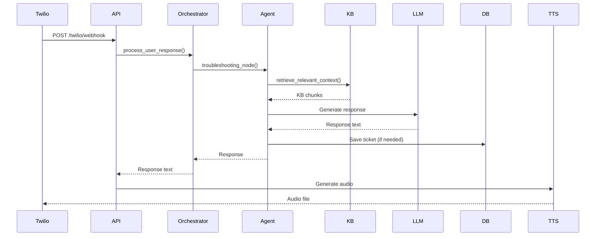

# Architecture

## System Overview

Voice-based IT support assistant using LLM for natural conversations and RAG for knowledge retrieval.



## Architecture Principles

### LLM-First Design

The system uses a **simple, LLM-powered approach**. The LLM handles:

- Understanding user intent
- Generating natural responses
- Deciding when to escalate
- Managing conversation flow

This makes the system **reliable across all scenarios** through natural language understanding.

### Low Latency Optimization

- **Minimal prompts**: 70% token reduction (400-600 tokens vs 1500-2000)
- **Truncated KB**: Top 3 chunks, 300 chars each
- **Short history**: Last 6 messages only
- **Fast LLM**: GPT-4o-mini with 10s timeout, 200 max tokens

### RAG Integration

Knowledge base articles are retrieved dynamically based on user's issue:

- Vector similarity search in ChromaDB
- Only retrieved when technical keywords detected
- Cached for 30 minutes to reduce API calls
- Formatted concisely for LLM context

## Core Components

### 1. Voice Pipeline



### 2. Agent Flow



### 3. LLM-Powered Agent

All logic handled by LLM:

The agent processes every user message through the troubleshooting node. This design provides consistent, reliable responses.

**How it works:**

1. Receives user message from Twilio
2. Retrieves KB context if technical issue detected
3. Gets caller history for personalization
4. Builds optimized prompt with conversation history
5. Calls LLM with system prompt + context
6. LLM generates natural response
7. System checks for escalation/resolution keywords
8. Creates tickets or saves to DB if needed
9. Returns response to Twilio for TTS

**Key Design Decision**: The LLM's natural language understanding handles all edge cases through conversation context.



## Data Flow

### Request Processing



## Key Services

### KB Retrieval Service

- **Purpose**: Retrieve relevant knowledge base articles
- **Method**: RAG with ChromaDB vector store
- **Optimization**: Caching (30min TTL, 100 entries max)
- **Performance**: Top 3 chunks, truncated to 300 chars each

**How it works:**

1. User mentions technical issue (printer, email, WiFi, etc.)
2. Service generates embedding of user query
3. Searches ChromaDB for similar chunks
4. Returns top 3 most relevant articles
5. Formats concisely for LLM prompt
6. Caches result for 30 minutes

**Why it's fast**: Only triggers on technical keywords, uses caching, limits results.

### Caller History Service

- **Purpose**: Personalize conversations with past interactions
- **Data**: Previous tickets, resolved issues, common problems
- **Usage**: Injected into LLM prompt for context

**How it works:**

1. Looks up tickets by phone number
2. Filters to last 30 days
3. Extracts: last resolved issue, last escalated issue, most common issue
4. Formats as natural context for LLM
5. LLM uses it to personalize greeting and skip redundant questions

**Example**: "I see you called about a printer issue last week. How can I help today?"

### Caller History Service

- **Purpose**: Personalize conversations with past interactions
- **Data**: Previous tickets, resolved issues, common problems
- **Usage**: Injected into LLM prompt for context

### Conversation Logger

- **Purpose**: Log all conversations for analysis
- **Storage**: File-based (markdown summaries) + Database
- **Features**: LLM-powered summaries, metrics tracking

**How it works:**

1. Stores full transcript as JSON
2. Generates markdown summary with metrics
3. Creates LLM-powered intelligent summary in background thread
4. Saves summary to database for querying
5. Tracks: message counts, duration, issue types, KB articles used

**Why background**: LLM summary generation is async to avoid blocking response.

### Ticket Service

- **Purpose**: Persist support tickets
- **Storage**: PostgreSQL
- **Integration**: Jira ticket creation on escalation

**When tickets are created:**

1. **On escalation**: When LLM response contains escalation keywords
2. **On resolution**: When user confirms issue is fixed
3. **Data stored**: Issue description, type, severity, KB articles used, conversation summary

**Jira integration**: Automatically creates Jira ticket with all context when escalated.

## State Management

### LangGraph State

```python
SupportTicketState:
  - messages: Conversation history (last 6 messages)
  - call_sid: Twilio call ID (unique per call)
  - ticket_data: Extracted issue info (type, description, severity)
  - kb_articles_used: Referenced KB docs (for analytics)
  - is_resolved: Issue resolved flag
  - is_escalated: Escalation flag
  - is_complete: Call ended flag
```

**State Flow:**

- Initial state: Empty messages, no ticket data
- Each turn: Adds user message + agent response
- State persists: Via Redis checkpointing
- Final state: Contains full conversation + ticket data

### Checkpointing

- **Storage**: Redis (production) or Memory (dev)
- **Purpose**: Maintain conversation state across turns
- **Key**: `thread_id` = `session_id` = `call_sid`

**How it works:**

1. Each user message creates a new graph invocation
2. LangGraph loads previous state from Redis using `call_sid`
3. Processes new message with full conversation context
4. Saves updated state back to Redis
5. This allows stateless API to handle stateful conversations

**Why Redis**: Fast, shared across multiple API instances, persistent.

## Performance Optimizations

### Low Latency Design

**Goal**: <2s end-to-end response time for natural conversation.

1. **Optimized Prompts**: ~70% token reduction

   - System prompt: 150 tokens (was 1200)
   - User prompt: 30 tokens (was 100)
   - **Impact**: Faster LLM API calls, lower cost

2. **KB Truncation**:

   - Top 3 chunks only (most relevant)
   - 300 chars per chunk (essential info)
   - 500 chars max in prompt (prevents token bloat)
   - **Impact**: Reduces prompt size without losing key information

3. **Conversation History**:

   - Last 6 messages (was 10)
   - Short labels (U:/A: instead of User:/Agent:)
   - **Impact**: Maintains context while reducing tokens

4. **LLM Config**:
   - Timeout: 10s (was 15s) - fails fast if slow
   - Max tokens: 200 - prevents long responses
   - **Impact**: Faster generation, more focused responses

**Result**: Average response time ~1.5s (LLM call + processing)

### Caching

- **KB Retrieval**: 30min TTL, 100 entries

  - Cache key: tenant_id + query + category
  - Prevents redundant vector DB queries
  - Auto-expires after 30 minutes
  - LRU eviction when cache full (100 entries)

- **Audio Files**: In-memory cache per call
  - Caches TTS audio for same text
  - Reduces ElevenLabs API calls
  - Cleared after call ends

**Cache Strategy**: Aggressive caching for read-heavy operations (KB, audio) to minimize latency.

## Database Schema

### support_tickets

```sql
- call_sid (PK)
- ticket_id
- session_id
- tenant_id
- from_number
- to_number
- issue_type
- issue_description
- severity
- status (resolved/escalated)
- jira_ticket_key
- conversation_summary
- kb_articles_used
- created_at
- updated_at
```

**Indexes**: `from_number`, `created_at`, `tenant_id`

## Technology Stack

| Component       | Technology                             |
| --------------- | -------------------------------------- |
| Voice           | Twilio Voice API                       |
| STT             | OpenAI Realtime API (Whisper fallback) |
| TTS             | ElevenLabs                             |
| LLM             | OpenAI GPT-4o-mini                     |
| RAG             | ChromaDB + OpenAI embeddings           |
| State           | LangGraph + Redis                      |
| Database        | PostgreSQL                             |
| Framework       | FastAPI (Python)                       |
| Package Manager | uv                                     |

## Error Handling

**Philosophy**: Never fail completely - always provide some response.

- **Graceful Degradation**:

  - KB retrieval fails → Continue with LLM knowledge only
  - Caller history fails → Continue with standard greeting
  - Jira creation fails → Log error, continue conversation
  - **Result**: User always gets a response, system continues operating

- **Fallback Responses**:

  - LLM API timeout → "I'm having technical difficulties. Please try again."
  - Empty LLM response → "I understand. How can I help you?"
  - **Result**: Never leaves user hanging

- **Error Recovery**:

  - Errors are logged and system continues
  - Fast failure detection with immediate fallback
  - **Result**: Minimal latency, always responsive

- **Logging**:
  - All errors logged with full context (call_sid, error, stack trace)
  - Structured logging for easy debugging
  - **Result**: Easy to diagnose issues in production

## Scalability

**Design**: Horizontal scaling ready.

- **Stateless API**:

  - FastAPI handles concurrent requests
  - All state stored in Redis/DB
  - **Result**: Can run multiple instances behind load balancer

- **Redis Checkpointing**:

  - Shared state across instances
  - Any instance can handle any call
  - **Result**: True horizontal scaling

- **Database Pooling**:

  - Connection pooling for PostgreSQL
  - Prevents connection exhaustion
  - **Result**: Handles high concurrent load

- **KB Caching**:
  - Reduces vector DB queries
  - In-memory cache per instance
  - **Result**: Lower latency, less DB load

**Limits**:

- LLM API rate limits (OpenAI)
- Twilio concurrent call limits
- Database connection pool size

**Scaling Strategy**: Add more API instances, scale Redis/PostgreSQL as needed.
